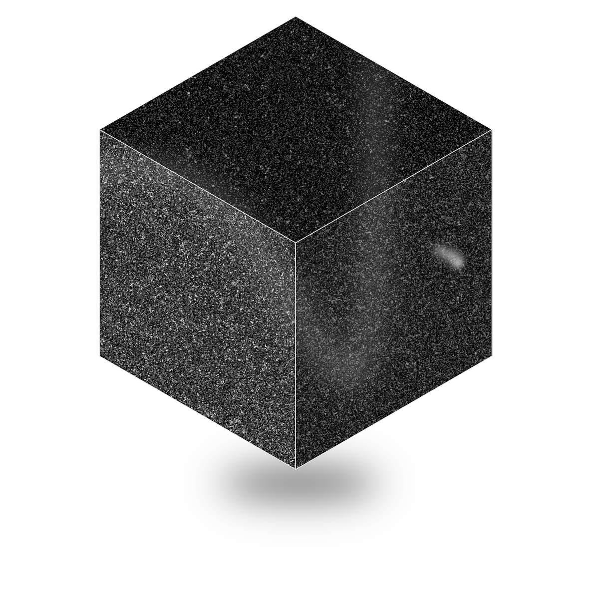

# Welcome to Void.

	

Void is the open-source Cursor alternative. This repo contains the full sourcecode for Void. We are currently in [open beta](https://voideditor.com/) for downloading the official release. If you're new, welcome!

- 👋 [Discord](https://discord.gg/RSNjgaugJs)

- 🚙 [Roadmap](https://github.com/orgs/voideditor/projects/2)

- 📝 [Changelog](https://voideditor.com/changelog)

<!-- ❤️ Setup: -->

## Contributing

1. To contribute to the Void repository, follow the steps in [`CONTRIBUTING.md`](https://github.com/voideditor/void/blob/main/CONTRIBUTING.md).
  
2. To suggest a new feature, please create a new [GitHub Issue](https://github.com/voideditor/void/issues). Suggestions will be added to our Roadmap within one day.

3. We're open to collaborations of all types. Feel free to contact us via email or discord.

## Reference

Void is a fork of the [vscode](https://github.com/microsoft/vscode) repository. For some useful links on VSCode, see [`VOID_USEFUL_LINKS.md`](https://github.com/voideditor/void/blob/main/VOID_USEFUL_LINKS.md).

## Support
Feel free to reach out in our discord or contact us via email.
